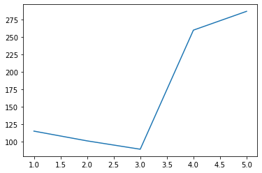
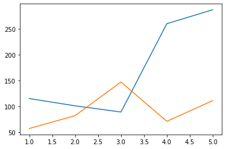
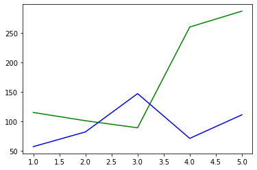
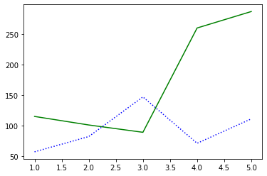
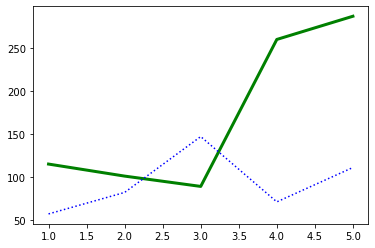
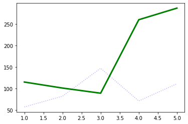
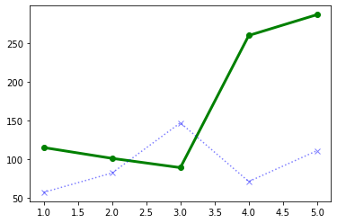
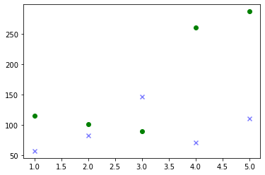
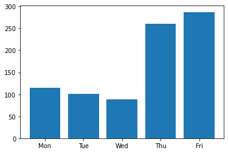

Week 4: Visualizing data with matplotlib
========================================
	
Outcome: Students will learn how to make basic plots in Python using `matplotlib`, the de-facto standard for visualization.

.. Instructor notes
.. Message: This class is only focused on how to use matplotlib, no deeper message of the day to take home

What we will do: 
	* Code to ... *draw* ?
	* What is matplotlib + setup check
	* Basic plotting
	* Basic configuration
	* Combining plot elements
	* Exercise: Writing a visualizer we will use soon ...
    .. * (No Adv Exercise: no concept to explore here)

Code to ... *draw*?
---------------------
.. Instructor notes: 
.. Estimated time: 20 mins
.. Section objective: Set the context of coding not to build something, but to show something.

In the last few weeks, we have been learning the basics of coding as a tool to execute logic. It might come as a surprise to you that coding is not all about logic, but can also be applied to generate visualizations. In fact, some people spend significant amounts of time using code to build the visualizations that they need! 

Visualization is typically done as part of data analysis work, to summarize and express the relationships in data in an intuitive manner. A few examples of neat visualizations made in code that you can find online:
	* `Gaze and the Control of Foot Placement When Walking in Natural Terrain, from Reddit <https://www.reddit.com/r/dataisbeautiful/comments/8bzdr8/gaze_and_foot_placement_when_walking_over_rough/>`_
	* `Wall St Journal graphic on the impact of vaccines <http://graphics.wsj.com/infectious-diseases-and-vaccines/>`_
	* `Visualizing the trade of small arms across the globe, Chrome Experiments <https://armsglobe.chromeexperiments.com/>`_
	* `Life In The Camps by Reuters <http://fingfx.thomsonreuters.com/gfx/rngs/MYANMAR-ROHINGYA/010051VB46G/index.html>`_
	* `World Health Chart by Gapminder <https://www.gapminder.org/fw/world-health-chart/>`_

In this class, we won't be making visualizations as impressive as these. These interactive visualizations make heavy use of Javascript-based libraries, of which is out of scope of this course. Instead, we will start small, and take a small step into making plots in Python, with `matplotlib`. 

What is matplotlib + setup check
--------------------------------
.. Instructor notes: 
.. Estimated time: 10 mins
.. Section objective: Brief intro to matplotlib, and take some time to ensure everyone is set up.

`matplotlib` is a widely used plotting library in Python, and is the de facto standard for scientific analysis. It enables users to generate publication-quality plots, and allows heavy customization to get plots that look exactly the way the users want to.

For this class, you will need to be using a local Python installation w/ the `matplotlib` package installed. If you were using an online REPL for the class, you will need to switch to using an IDE like Spyder. `matplotlib` is installed by default if you are using Anaconda Python. Else, you will need to install it separately. 

If you are able to run the following code chunk and see plot output, you are good to go.
::

	import matplotlib.pyplot as plt
	plt.plot([1, 2, 3, 4], [1, 2, 3, 4])
	plt.show()

Basic plotting
--------------
.. Instructor notes: 
.. Estimated time: 20 mins
.. Section objective: Introduce students to basic plotting functions. 
.. [-]Should prepare the data for this? --> Not really, just need sth that works
.. [X]Importing packages: matplotlib

Using `matplotlib` requires you to **import** it in Python before usage. It is a library that contains functions not available in standard Python. Thus, the act of `import`-ing the library makes its functions available for us to use. Make sure the following line has been run before using any functions from `matplotlib`:
::

	import matplotlib.pyplot as plt

`plt.plot`
^^^^^^^^^^
.. [X]`plt.plot`

`plt.plot` is one of the most common plotting functions used in the library. Give it sequences of values as `x` and `y`, and `plt.plot(x, y)` will give you a line of `y` over `x`. 

::

	# Data to plot
	days = [1, 2, 3, 4, 5]
	covid_cases = [115, 101, 89, 260, 287]

	# Plot
	plt.plot(days, covid_cases)
	plt.show()

In the example above, we plotted the new COVID cases in Malaysia for Monday to Friday (Sep 28 to Oct 2) in one line. Right now the image looks rather basic, but we will get around to formatting it later in this session. 

.. note ::
    The `plt.show()` command prompts `matplotlib` to display the image instead of waiting for more input. You need to call it to get the plot to show. 

If we want to compare the numbers on the plot with the case count from the previous week, we can do that by adding some code to draw the extra line:
::

	# Data to plot
	days = [1, 2, 3, 4, 5]
	covid_cases = [115, 101, 89, 260, 287]
	last_week_covid_cases = [57, 82, 147, 71, 111]

	# Plot
	plt.plot(days, covid_cases)
	plt.plot(days, last_week_covid_cases)
	plt.show()

Notice that `matplotlib` automatically assigned the second line a different colour. Just like when making plots in Microsoft Excel, there are many settings for plotting under the hood. When none of the settings are specified, `matplotlib` falls back on reasonable defaults, in this case giving each line its own colour. Let's take a closer look at how we can format the lines from `plt.plot`.

Formatting `plt.plot`: color, linestyle, linewidth, transparency, and markers
^^^^^^^^^^^^^^^^^^^^^^^^^^^^^^^^^^^^^^^^^^^^^^^^^^^^^^^^^^^^^^^^^^^^^^^^^^^^^
.. [X]Formatting linestyle and colors

First we will modify the **colour** of the lines. Go ahead and add `color="green"` inside the first `plt.plot`, and `color="blue"` inside the second `plt.plot`. You will find that the color of the lines have changed as specified:

.. note ::
	Colour of a line is specified through the `color` argument (be mindful, of the American spelling!) in `plt.plot`. There are many ways to set color, either using full names of common colors, specifying an RGB tuple, or providing the hex code of a colour in string! 

Next, we will adjust the **linestyle**. By default, the lines plotted are solid lines. We want to change the line that reflects last week's cases to be a dotted line instead. We can do this by adding `ls="dotted"` to the second `plt.plot`. 

.. note ::
	The `ls` argument decides the line style. Like colour, there are many methods to specify line style. We will focus on providing string argument (e.g. `ls="dashdot"`). The available options are: `"solid"`, `"dashed"`, `"dashdot"`, and `"dotted"`. 

Now, we want to specify the **linewidth** instead. We want to make the line thicker for current cases. The default width is 1. To do this, add `lw=3` to the first `plt.plot`.

.. note ::
	`lw` specifies line width in points. Defaults to 1.  

Moving ahead, we want to further make the line representing the previous week's cases to have some level of **transparency**. To do this, add `alpha=0.3` to the second `plt.plot`.

.. note ::
	The `alpha` argument denotes transparency. It takes values between 0 and 1. 0 gives a fully transparent line, while 1 gives a fully opaque line. 

One last thing; from the looks of our lines, it is not obvious where the data points are. Let us add **markers** so that we can see exactly where our data points are. Let's add `marker="o"` to the first `plt.plot` and `marker="x"` to the second `plt.plot`. 

At this point, your code should look like this:
::

	# Data to plot
	days = [1, 2, 3, 4, 5]
	covid_cases = [115, 101, 89, 260, 287]
	last_week_covid_cases = [57, 82, 147, 71, 111]

	# Plot
	plt.plot(days, covid_cases, color="green", lw=3, marker="o")
	plt.plot(days, last_week_covid_cases, 
			color="blue", ls="dotted", alpha=0.3, marker="x")
	plt.show()

.. note ::
	The `marker` argument marks the exact location of the data point, with the specified shape. Like the other styling options, there are many ways to specify markers. The most common options are `"o"`, `"x"`, and `"+"`.

`plt.scatter`
^^^^^^^^^^^^^
.. [X]`plt.scatter`

At the end of the section above, we have plotted a small dataset and added markers to the plot. If we want to only use markers instead of lines, we can go use `plt.scatter`.

If you take the code above, and change `plt.plot` to `plt.scatter`, you will find that `matplotlib` will still be able to give you a plot, which will look like this: 

.. note::
	This is a special case! It is possible for `plt.plot` and `plt.scatter` to have different arguments. Be mindful when changing from line to scatter. 

`plt.bar`
^^^^^^^^^
.. [X]`plt.bar`

In the above data, we have been representing the days Monday to Friday by the numbers 1 to 5. As a result, `matplotlib` gives us a numeric x-axis. Thus, instead of having the x-axis marked by numbers 1 to 5 by default, `matplotlib` produced a number line with intervals of 0.5. To remedy this, we will be changing the information on our x-axis from numbers to categories, like below:
::

	days = ["Mon", "Tue", "Wed", "Thu", "Fri"]

We will substitute instead a list of strings representing the days of the week. As a result, we will also need to change our plot type for categorical data. This is where a bar plot comes in useful. 

Use the following code to plot the modified data as a bar plot:
::

	# Data to plot
	days = ["Mon", "Tue", "Wed", "Thu", "Fri"]
	covid_cases = [115, 101, 89, 260, 287]

	# Plot
	plt.bar(days, covid_cases)
	plt.show()

.. note::
	`plt.bar` has a similar format as `plt.plot` and `plt.scatter` above. Given `x` and `height`, `plt.bar(x, height)` will produce a bar plot, where the location of each bar is given by `x`, and the height of each bar is given by `height`. 

`plt.axhline`
^^^^^^^^^^^^^
.. [X]`plt.axhline`

On the bar plot above, let's say that we want to draw a horizontal line across the plot, to mark 200 cases. We can do that simply by adding the following line to the plot:
::

	plt.axhline(200, color="red")

.. note::
	`plt.axhline` draws a horizontal line on the plot, thus the name `hline`. The most important argument to pass to this function is the y value where you want the line to be drawn. It also takes other formatting arguments similar to `plt.plot` above. 
	
	To draw a vertical line instead, use `plt.axvline`. 

Exercise: Recreating the World Health Chart I
---------------------------------------------
.. Instructor notes: Data prep needed, plus need to do this firsthand to decide how to structure it
.. Estimated time: 15 mins
.. Section objective: 

Enough with synthetic data that has no meaning, let us work on visualizing real data! In this exercise, we will be recreating the World Health Chart example seen above. 

.. TODO:Add elaboration on the axes
.. TODO:From the experimentation, split out the scope, then write instructions! 

Basic configuration and styling
-------------------------------
.. Instructor notes: 
.. Estimated time: 20 mins
.. Section objective: Introduce students to basic configuration options for customizing plots. 
.. [ ]`plt.figure`
.. [ ]`plt.title`
.. [ ]`plt.legend and labels`
.. [ ]`plt.xscale` and `plt.yscale`
.. [ ]Setting color for plot elements
.. [ ]Setting size for plot elements

Exercise: Recreating the World Health Chart II
----------------------------------------------
.. Instructor notes: 
.. Estimated time: 15 mins
.. Section objective: 

Exercise: More plotting
-----------------------
.. Instructor notes: 
.. Estimated time: 15 mins
.. Section objective: Allow students to practice applying basic plotting and basic configuration 
.. [ ]Exercise: Concentric circle rings w/ different styles
.. [ ]Exercise: Recreate classic life expectancy by country over time plot
.. [ ]Last exercise: Dinosaur plot just for the lols

.. Exercise: Writing a visualizer we will use soon ...
.. ---------------------------------------------------
.. Instructor notes: 
.. Estimated time: 20 mins
.. Section objective: Write visualizer needed for automata exercise next class.
.. [ ]Instructor solution for fluid simulator in next class first! 
.. [ ]Then only possible to design this prompt! 

Conclusion
----------
.. Instructor notes
.. Estimated time: <5 mins
.. Section objective: Recap and re-emphasize message
.. [ ] Recap on things learnt

Further reading
---------------
Official `matplotlib` documentation by Matplotlib development team: https://matplotlib.org/contents.html