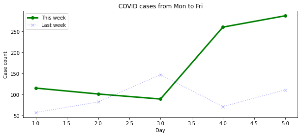
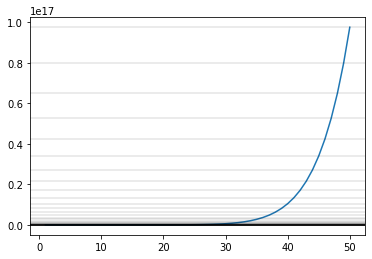
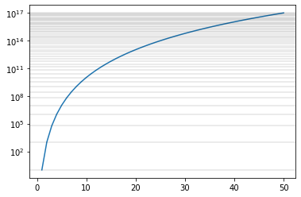
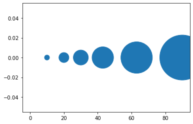
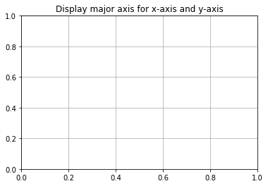

Week 4: Visualizing data with matplotlib
========================================
	
Outcome: Students will learn how to make basic plots in Python using `matplotlib`, the de-facto standard for visualization.

.. Instructor notes
.. Message: This class is only focused on how to use matplotlib, no deeper message of the day to take home

What we will do: 
	* Code to ... *draw* ?
	* What is matplotlib + setup check
	* Basic plotting
	* Plotting from CSV files
	* Basic styling
	* Slightly more advanced styling
	* Exercise: Recreating the World Health Chart
    .. * (No Adv Exercise: no concept to explore here)

Code to ... *draw*?
---------------------
.. Instructor notes: 
.. Estimated time: 20 mins
.. Section objective: Set the context of coding not to build something, but to show something.

In the last few weeks, we have been learning the basics of coding as a tool to execute logic. It might come as a surprise to you that coding is not all about logic, but can also be applied to generate visualizations. In fact, some people spend significant amounts of time using code to build the visualizations that they need! 

Visualization is typically done as part of data analysis work, to summarize and express the relationships in data in an intuitive manner. A few examples of neat visualizations made in code that you can find online:
	* `Gaze and the Control of Foot Placement When Walking in Natural Terrain, from Reddit <https://www.reddit.com/r/dataisbeautiful/comments/8bzdr8/gaze_and_foot_placement_when_walking_over_rough/>`_
	* `Wall St Journal graphic on the impact of vaccines <http://graphics.wsj.com/infectious-diseases-and-vaccines/>`_
	* `Visualizing the trade of small arms across the globe, Chrome Experiments <https://armsglobe.chromeexperiments.com/>`_
	* `Life In The Camps by Reuters <http://fingfx.thomsonreuters.com/gfx/rngs/MYANMAR-ROHINGYA/010051VB46G/index.html>`_
	* `World Health Chart by Gapminder <https://www.gapminder.org/fw/world-health-chart/>`_

In this class, we won't be making visualizations as impressive as these. These interactive visualizations make heavy use of Javascript-based libraries, of which is out of scope of this course. Instead, we will start small, and take a small step into making plots in Python, with `matplotlib`. 

What is matplotlib + setup check
--------------------------------
.. Instructor notes: 
.. Estimated time: 10 mins
.. Section objective: Brief intro to matplotlib, and take some time to ensure everyone is set up.

`matplotlib` is a widely used plotting library in Python, and is the de facto standard for scientific analysis. It enables users to generate publication-quality plots, and allows heavy customization to get plots that look exactly the way the users want to.

For this class, you will need to be using a local Python installation w/ the `matplotlib` package installed. If you were using an online REPL for the class, you will need to switch to using an IDE like Spyder. `matplotlib` is installed by default if you are using Anaconda Python. Else, you will need to install it separately. 

If you are able to run the following code chunk and see plot output, you are good to go for today's class.
::
	import pandas as pd
	import matplotlib.pyplot as plt
	plt.plot([1, 2, 3, 4], [1, 2, 3, 4])
	plt.show()

Basic plotting
--------------
.. Instructor notes: 
.. Estimated time: 20 mins
.. Section objective: Introduce students to basic plotting functions. 
.. [-]Should prepare the data for this? --> Not really, just need sth that works
.. [X]Importing packages: matplotlib

Using `matplotlib` requires you to **import** it in Python before usage. It is a library that contains functions not available in standard Python. Thus, the act of `import`-ing the library makes its functions available for us to use. Make sure the following line has been run before using any functions from `matplotlib`:
::

	import matplotlib.pyplot as plt

`plt.plot`
^^^^^^^^^^
.. [X]`plt.plot`

`plt.plot` is one of the most common plotting functions used in the library. Give it sequences of values as `x` and `y`, and `plt.plot(x, y)` will give you a line of `y` over `x`. 

::

	# Data to plot
	days = [1, 2, 3, 4, 5]
	covid_cases = [115, 101, 89, 260, 287]

	# Plot
	plt.plot(days, covid_cases)
	plt.show()

.. figure:: images/matplotlib01.png
   :alt: Outcome of `plt.plot(days, covid_cases)`

In the example above, we plotted the new COVID cases in Malaysia for Monday to Friday (Sep 28 to Oct 2) in one line. Right now the image looks rather basic, but we will get around to formatting it later in this session. 

.. note ::
    The `plt.show()` command prompts `matplotlib` to display the image instead of waiting for more input. You need to call it to get the plot to show. 

If we want to compare the numbers on the plot with the case count from the previous week, we can do that by adding some code to draw the extra line:
::

	# Data to plot
	days = [1, 2, 3, 4, 5]
	covid_cases = [115, 101, 89, 260, 287]
	last_week_covid_cases = [57, 82, 147, 71, 111]

	# Plot
	plt.plot(days, covid_cases)
	plt.plot(days, last_week_covid_cases)
	plt.show()

.. figure:: images/matplotlib02.png
   :alt: Adding another line to the plot

Notice that `matplotlib` automatically assigned the second line a different colour. Just like when making plots in Microsoft Excel, there are many settings for plotting under the hood. When none of the settings are specified, `matplotlib` falls back on reasonable defaults, in this case giving each line its own colour. Let's take a closer look at how we can format the lines from `plt.plot`.

Formatting `plt.plot`: color, linestyle, linewidth, transparency, and markers
^^^^^^^^^^^^^^^^^^^^^^^^^^^^^^^^^^^^^^^^^^^^^^^^^^^^^^^^^^^^^^^^^^^^^^^^^^^^^
.. [X]Formatting linestyle and colors

First we will modify the **colour** of the lines. Go ahead and add `color="green"` inside the first `plt.plot`, and `color="blue"` inside the second `plt.plot`. You will find that the color of the lines have changed as specified:

.. figure:: images/matplotlib03.png
   :alt: Modified line colour

.. note ::
	Colour of a line is specified through the `color` argument (be mindful, of the American spelling!) in `plt.plot`. There are many ways to set color, either using full names of common colors, specifying an RGB tuple, or providing the hex code of a colour in string! 

Next, we will adjust the **linestyle**. By default, the lines plotted are solid lines. We want to change the line that reflects last week's cases to be a dotted line instead. We can do this by adding `ls="dotted"` to the second `plt.plot`. 

.. figure:: images/matplotlib04.png
   :alt: Modified linestyle

.. note ::
	The `ls` argument decides the line style. Like colour, there are many methods to specify line style. We will focus on providing string argument (e.g. `ls="dashdot"`). The available options are: `"solid"`, `"dashed"`, `"dashdot"`, and `"dotted"`. 

Now, we want to specify the **linewidth** instead. We want to make the line thicker for current cases. The default width is 1. To do this, add `lw=3` to the first `plt.plot`.

.. figure:: images/matplotlib05.png
   :alt: Modified linewidth

.. note ::
	`lw` specifies line width in points. Defaults to 1.  

Moving ahead, we want to further make the line representing the previous week's cases to have some level of **transparency**. To do this, add `alpha=0.3` to the second `plt.plot`.

.. figure:: images/matplotlib06.png
   :alt: Added transparency

.. note ::
	The `alpha` argument denotes transparency. It takes values between 0 and 1. 0 gives a fully transparent line, while 1 gives a fully opaque line. 

One last thing; from the looks of our lines, it is not obvious where the data points are. Let us add **markers** so that we can see exactly where our data points are. Let's add `marker="o"` to the first `plt.plot` and `marker="x"` to the second `plt.plot`. 

At this point, your code should look like this:
::

	# Data to plot
	days = [1, 2, 3, 4, 5]
	covid_cases = [115, 101, 89, 260, 287]
	last_week_covid_cases = [57, 82, 147, 71, 111]

	# Plot
	plt.plot(days, covid_cases, color="green", lw=3, marker="o")
	plt.plot(days, last_week_covid_cases, 
			color="blue", ls="dotted", alpha=0.3, marker="x")
	plt.show()

.. figure:: images/matplotlib07.png
   :alt: Added marker

.. note ::
	The `marker` argument marks the exact location of the data point, with the specified shape. Like the other styling options, there are many ways to specify markers. The most common options are `"o"`, `"x"`, and `"+"`.

`plt.scatter`
^^^^^^^^^^^^^
.. [X]`plt.scatter`

At the end of the section above, we have plotted a small dataset and added markers to the plot. If we want to only use markers instead of lines, we can go use `plt.scatter`.

If you take the code above, and change `plt.plot` to `plt.scatter`, you will find that `matplotlib` will still be able to give you a plot, which will look like this: 

.. figure:: images/matplotlib08.png
   :alt: `plt.scatter`

.. note::
	This is a special case! It is possible for `plt.plot` and `plt.scatter` to have different arguments. Be mindful when changing from line to scatter. 

`plt.bar`
^^^^^^^^^
.. [X]`plt.bar`

In the above data, we have been representing the days Monday to Friday by the numbers 1 to 5. As a result, `matplotlib` gives us a numeric x-axis. Thus, instead of having the x-axis marked by numbers 1 to 5 by default, `matplotlib` produced a number line with intervals of 0.5. To remedy this, we will be changing the information on our x-axis from numbers to categories, like below:
::

	days = ["Mon", "Tue", "Wed", "Thu", "Fri"]

We will substitute instead a list of strings representing the days of the week. As a result, we will also need to change our plot type for categorical data. This is where a bar plot comes in useful. 

Use the following code to plot the modified data as a bar plot:
::

	# Data to plot
	days = ["Mon", "Tue", "Wed", "Thu", "Fri"]
	covid_cases = [115, 101, 89, 260, 287]

	# Plot
	plt.bar(days, covid_cases)
	plt.show()

.. figure:: images/matplotlib09.png
   :alt: `plt.bar`

.. note::
	`plt.bar` has a similar format as `plt.plot` and `plt.scatter` above. Given `x` and `height`, `plt.bar(x, height)` will produce a bar plot, where the location of each bar is given by `x`, and the height of each bar is given by `height`. 

`plt.axhline`
^^^^^^^^^^^^^
.. [X]`plt.axhline`

On the bar plot above, let's say that we want to draw a horizontal line across the plot, to mark 200 cases. We can do that simply by adding the following line to the plot:
::

	plt.axhline(200, color="red")

.. figure:: images/matplotlib10.png
   :alt: `plt.axhline`

.. note::
	`plt.axhline` draws a horizontal line on the plot, thus the name `hline`. The most important argument to pass to this function is the y value where you want the line to be drawn. It also takes other formatting arguments similar to `plt.plot` above. 
	
	To draw a vertical line instead, use `plt.axvline`. 

Plotting from CSV files
-----------------------
.. Instructor notes: Have to get into `pandas` to be able to load files!
.. Estimated time: 15 mins
.. Section objective: 
.. [ ]What is pandas
.. [ ]Importing pandas and reading a csv file with it
.. [ ]What's in the file

In this section, we will learn how to load data from a CSV file, and apply our newfound knowledge to plot it. 

Load CSV files using `pd.read_csv`
^^^^^^^^^^^^^^^^^^^^^^^^^^^^^^^^^^

Download the CSV from the link given in class, and save it to the same folder that your code is running in. The filename should be `mystery_data.csv`. Then, run the following code:
::

	import pandas as pd
	data = pd.read_csv("mystery_data.csv")
	print(data.head())

What do you see? 

Let's go through these three lines of code. 
	1. First, we imported a library called `pandas` and referred to it as `pd`. `pandas` is a library that makes it simple to load and handle data. In a way, you can say it is the Excel of Python. 
	2. We imported `pandas` because we want to use this function, `pd.read_csv`. As you might be able to guess from the name, this function reads data from a CSV file. The variable `data` is now a DataFrame in `pandas`. Think of it as it being now a spreadsheet. 
	3. This line prints the first 5 rows of the DataFrame. If you open up the CSV file in Excel, you will see that the data in the CSV file matches up. 

Accessing data by columns from DataFrames
^^^^^^^^^^^^^^^^^^^^^^^^^^^^^^^^^^^^^^^^^
Go ahead and run the following code:
::

	print(data.index)
	print(data.columns)
	print(data["x"])
	print(data["y"])

Compare this with the output from the code before. Notice that: 
	* `data.index` gives the indices, in a list. Indices represent the length of a DataFrame. In this case, our indices are a range of integers from 0 to 142.
	* `data.columns` gives the names of the columns, in a list. Columns represent the width of a DataFrame. In this case, we have two columns, called `x` and `y`. 
	* Passing `x` and `y` into a square bracket after `data` allows us to access columns `x` and `y`!

.. note::
	The syntax for accessing columns in a given DataFrame in variable `data`, is `data[name]`, where `name` is the name of the column. 
	
Make the plot
^^^^^^^^^^^^^
With this information above, go ahead and make a scatter plot of column `x` on the x-axis, and `y` on the y-axis. What do you see? :)

Basic styling
-------------
.. Instructor notes: 
.. Estimated time: 20 mins
.. Section objective: Introduce students to basic configuration options for customizing plots. 
.. [X]`plt.figure`
.. [X]`plt.title`
.. [X]`plt.legend`
.. [X]`plt.xlabel` and `plt.ylabel`

So far from the plots above, we've looked at formatting the plot elements, but not the plot figure itself. Let's look at how to do that, picking up from the line plots above.

We will add the following lines of code:
::

	# Add this line! 
	plt.figure(figsize=(10, 4))

	# Data to plot
	days = [1, 2, 3, 4, 5]
	covid_cases = [115, 101, 89, 260, 287]
	last_week_covid_cases = [57, 82, 147, 71, 111]

	# Plot
	# Add keyword `label`
	plt.plot(days, covid_cases, color="green", lw=3, marker="o", label="This week")
	plt.plot(days, last_week_covid_cases, color="blue", ls="dotted", alpha=0.3, marker="x", label="Last week")
	
	# Add these lines!
	plt.title("COVID cases from Mon to Fri")
	plt.xlabel("Day")
	plt.ylabel("Case count")
	plt.legend()
	plt.show()

The lines of code we added has introduced changes to the plot like so:
	* figure size has changed
	* plot title is added
	* plot axes are labelled
	* plot legend is added

.. note ::
	`plt.figure()` accepts many arguments for plot formatting. In this case, we passed `figsize=(10, 4)`, which sets the figure size to a width of 10 inches by 4 inches.

.. note ::
	`plt.title()` accepts a string as input to set as title.

.. note ::
	`plt.xlabel()` and `plt.ylabel()` accepts a string as input each, to be displayed as x-axis and y-axis labels. 

.. note ::
	`plt.legend()` displays the legend of each plot element (e.g. line, scatter). Note that each plot element needs to add the argument `label=<name>` for it to show up on the legend. 

Slightly more advanced styling
------------------------------
.. Instructor notes: 
.. Estimated time: 20 mins
.. Section objective: Introduce students to the specific advanced styling options used in the world health chart exercise later. 
.. [X]Plotting data on a log scale using `plt.xscale`
.. [X]Controlling scatter size in `plt.scatter`
.. [X]Displaying grid

Now we will look at slightly more advanced styling options that are not as commonly used as the above.

Setting scale for log axis
^^^^^^^^^^^^^^^^^^^^^^^^^^
Occasionally we will run into data that are only meaningful when displayed on the logarithmic scale. Look at the code and the subsequent output below that demonstrates how to set the scale for plotting exponential data:
::
	x = list(range(1, 51))

	y = []
	for i in x:
		y.append(i ** 10)

	plt.plot(x, y)
	for i in y:
		plt.axhline(i, alpha=0.1, color="black")
	plt.show()

In this plot above, we have drawn straight lines to represent the values on the y-axis. Notice that scale is too big to meaningfully display data from x=0 to 30! If we modify the plotting code to use a log scale, we will be able to better represent the range of data:
::
	plt.plot(x, y)
	plt.yscale("log")
	plt.show()

.. note::
	Use `plt.xscale` or `plt.yscale` to modify the x-axis or y-axis of the plot. Pass "log" to display in log scale. Default is "linear".

Representing more than two dimensions of data through scaling point size on scatter plots
^^^^^^^^^^^^^^^^^^^^^^^^^^^^^^^^^^^^^^^^^^^^^^^^^^^^^^^^^^^^^^^^^^^^^^^^^^^^^
Typically, plots represent data in two-dimensions, due to plots only having the x-axis and y-axis. However, it is actually possible to represent more than two dimensions visually, by use specific properties of plot elements. For example, we can manipulate the size of the points on a scatter plot to represent an extra dimension. See the example below:
::

	x = [0, 10, 20, 30, 43, 63, 90]
	y = [0, 0, 0, 0, 0, 0, 0]
	s = []

	for i in x:
		s.append(i ** 2)

	plt.scatter(x, y, s=s)
	plt.show()

.. note::
	Specify the optional argument `s` in `plt.scatter` as above, to set the size of the points. 

Displaying grid lines
^^^^^^^^^^^^^^^^^^^^^
Notice that our plots do not have gridlines by default. If we want to toggle displaying grid lines in `matplotlib`, there is a simple function that does that: `plt.grid`.

Take a look at the code and the output below:
::

	plt.title("Display major axis for x-axis and y-axis")
	plt.grid(which="major", axis="both")
	plt.show()

.. note:: `plt.grid` has two key arguments, `which` and `axis`, and multiple optional arguments, like all `matplotlib` functions.
	* Fill in `major`, `minor`, or `both` for `which` to specify which gridlines to display. Note that plots don't always have `minor` axes, depending on the scale.
	* Fill in `x`, `y` or `both` to choose which axes to display gridlines.
	* Specify `alpha` to set the transparency of the gridlines.  

Exercise: Recreating the World Health Chart
-------------------------------------------
.. Instructor notes: Data prep needed, plus need to do this firsthand to decide how to structure it
.. Estimated time: 15 mins
.. Section objective: 

We now have learnt enough to be able to work on real data. In this exercise, we will be recreating the World Health Chart example seen above. 

Data used in the chart for 2020 has been retrieved in advance. Use the link provided in class to download the CSV file, and follow the in-class instructions. Use the following code as a template:
::

	import matplotlib.pyplot as plt
	import pandas as pd

	# Importing data
	# YOUR CODE BELOW

	# Making variables for convenience
	life = df["life"]
	income = df["income"]
	pop = df["pop"]
	cont = df["continent"]
	countries = df.index

	# Making the plot
	# YOUR CODE BELOW

Our workflow will be as below:
	1. Load the data
	
	2. Understand the elements on the original plot
	
	3. Scatter of income on x-axis, and life expectancy on y-axis.
	
	4. Set x-axis to be log scale.
	
	5. Specify scatter size by using population, measured in millions (i.e. divide by 1e6).
	
	6. Specify color by continents! Paste the following as part of the plotting function:

	::
	
		c=cont_nums, cmap="tab10", alpha=0.6

	7. Label the following:
		* x-axis with `Income per person (GDP/capita, PPP$ inflation-adjusted`
		* y-axis with `Life expectancy (years)`
		* title with `World Health Map - 2020`
	8. Add grid lines to both x-axis and y-axis, with 0.3 transparency.
	9. Package this as a function, so that we can use this for data from different years.

Conclusion
----------
.. Instructor notes
.. Estimated time: <5 mins
.. Section objective: Recap and re-emphasize message
.. [ ] Recap on things learnt

Further reading
---------------
Official `matplotlib` documentation by Matplotlib development team: https://matplotlib.org/contents.html