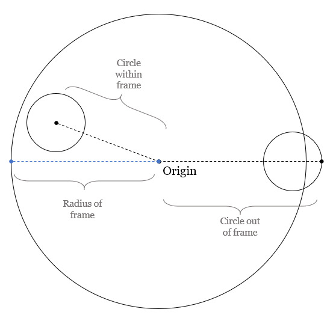
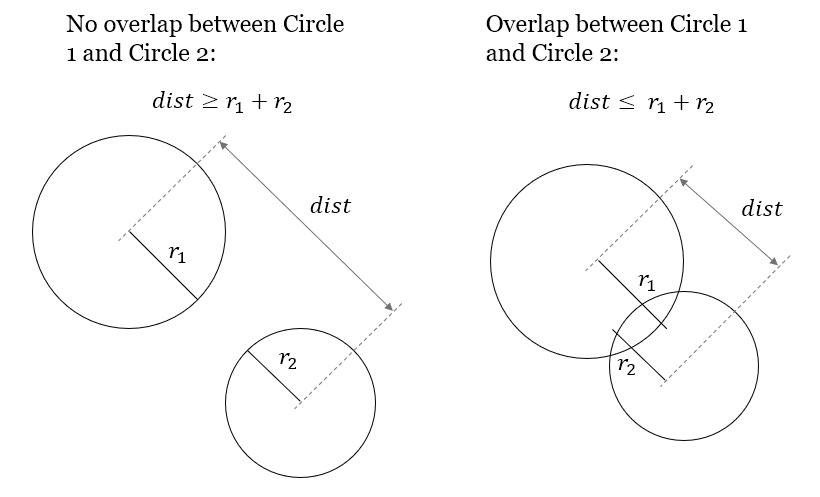

Week 9 : Randomness and Generative art
======================================

Outcome: Students will learn about random numbers in computing, and learn about its relationship with a rather niche application of coding, generative art.

What we will do:
    * Setup check + intro to randomness
    * Why do we need randomness in computing?
    * Randomness using `numpy.random`
    * Generative art with code
    * Primer on `turtle` graphics library
    * Exercise: Circle packing generative art

Setup check + intro to randomness
---------------------------------
.. Section objective:
.. Estimated time: 5 mins
.. Instructor notes:

Setup check
^^^^^^^^^^^
If you can run the following code chunk, you are good to go!
::

    import numpy
    import turtle
    import PIL

Intro to randomness
^^^^^^^^^^^^^^^^^^^
.. [X]What it is
Randomness could be said as a series of events taking place without any meaning or independent of any possible rule. It has neither cause nor meaning. (`What is Randomness <https://sci-highs.com/what-is-randomness/>`_). However randomness is hard to define. In a way it can be said that the very definition of randomness is a paradox as what we perceive as randomness is simply our unawareness of of the rules/laws that has caused that randomness. In other words, we cannot at this time with all our theories and formulas make out the pattern of a random thing.

Randomness is used in a lot of fields particularly with those that are related to mathematics. In these cases, randomness represents what we explicitly don't know! For instance in statistics, a random sample is important to ensure that a certain study is conducted effectively and without any bias. It is also used in describing the motion of microscopic particles suspended in a fluid all the way to solving deterministic models in nuclear physics.

Given that randomness is very important, it is important to be able to generate a random number that as random as random gets. However, it is hard to generate a number or a sequence that is truly random. For instance a computer cannot truly generate random numbers. A computer after all follows a set of instructions and won't stray from those instructions. However, it is possible to use pseudo-random number generators to generate a sequence of numbers that are close to being random. Furthermore, it is possible to generate random numbers from observing truly random information, e.g. mouse movement data, fan noise, CPU load etc. then inputting it to the pseudo-random number generator to obtain a sequence of random numbers that may work for most cases.

Why do we need randomness in computing?
---------------------------------------
.. Section objective:
.. Estimated time: 10 mins
.. Instructor notes:

.. [X]Randomness for cryptographic security
.. [X]Randomness as part of statistical computing

Cryptographic security
^^^^^^^^^^^^^^^^^^^^^^

Another field in which randomness is deeply involved is computing. This ranges from computer security, statistical computing, to test whether a number is prime, to stimulate complex systems among others.

Cryptographic security is a field in computing that is very widely used. Think of everything you can do via a computer that involves any sense of security, and cryptographic security is there. This ranges from your everyday Whatsapp messages, your occasional email sending and receiving to logging into your Facebook. All of these use a specific cryptographic method to mask your details so your details do not get exposed to any unintended recipients. Cryptography does this by including a random number or sequence that is included whenever a transaction happens.

Statistical computing
^^^^^^^^^^^^^^^^^^^^^

In the field of statistical computing, randomness is an important especially in a selection of random sample from a set of a population of interest. However, according to statistical theory, the most unexpected experimental results—equally probable or not—can be (approximately) reduced to some sort of statistical regularity. This suggests that there is some sort of order even in the most random of events, whether science ever discovers it (Encyclopedia.com).

As said before, it is hard to generate a truly random number because computers follows fixed instructions. Due of this and the wide use of randomness in our day to day life, the quality of randomness is important. If a website uses an old encryption method that uses low quality randomness, hackers can easily exploit the log on details in this website as these seemingly random alphanumeric characters are not random enough.

Sampling random numbers with `numpy.random`
-------------------------------------------
.. Section objective:
.. Estimated time: 15 mins
.. Instructor notes:

.. [ ]Explain np.random.uniform, np.random.normal
.. [ ]Little exercise to program your own pair of dice

Random sampling also goes hand-in-hand with working with probability distributions. A probability distribution is a function that models the probability certain values will occur. We can have probability distributions fo anything: the chance it will rain, the chance that all students in a class will pass with flying colours, the chance that a place will be struck by lightning twice etc. As long as we want to work with probabilistic events, we specify them with probability distributions.

To actually make use of the probability distribution however, we need to select data generated from the distribution, i.e. sample from the distribution. Here is how we will approach these few situations below, using `numpy.random`.

Sampling discrete distributions
^^^^^^^^^^^^^^^^^^^^^^^^^^^^^^^
A dice can generate the numbers 1 to 6 with equal probability. Since we have 6 discrete outcomes, the probability of each outcome is 1/6. 

We can run the following code to simulate a dice roll:
::

    np.random.choice([1, 2, 3, 4, 5, 6])

`np.random.choice` takes a list of possible outcomes as input, and returns the output of random sampling.

It is possible to have `numpy` repeat random sampling and generate an array of desired shape, by filling in the `size` argument like below:
::

    np.random.choice([1, 2, 3, 4, 5, 6], size=(10, ))

which will return results from 10 dice rolls in an array with `shape=(10, )`.

Sampling from uniform and normal distributions
^^^^^^^^^^^^^^^^^^^^^^^^^^^^^^^^^^^^^^^^^^^^^^
Two of the most common distributions relevant to our daily lives are the uniform distribution, and normal distribution.

A uniform distribution basically means that any number between the specified low and high range has an equal probability of being sampled. For example, when asked to guess the age of a cat, you might estimate it to be somewhere between 3 to 5 years. If you are not more confident on any number within this range, then your estimate for the cat's age can be represented as a uniform distribution. You can sample estimates for the aforementioned cat's age like so:
::

    np.random.uniform(low=3, high=5)

Notice that the `low` and `high` parameters need to be specified. Same as `np.random.choice`, this function supports `size` as an argument to generate array output.

A normal distribution is a distribution that occurs naturally in multiple situations. Population IQ, population height, average grades etc follow a normal distribution. Basically, if there isn't a driving reason for data to exhibit a specific distribution, most likely it will be a normal distribution. For example, if we collected rainfall data from a meteorology station, and calculated the mean to be 1000 mm, and the standard deviation to be 100mm, we can approximate it as a normal distribution with exactly these parameters. Estimates for rainfall data can thus be sampled with the code below:
::

    np.random.normal(loc=1000, scale=100)

For normal distributions, we specify the mean and std deviation instead of high and low bounds like in the previous example. Like before, this function also takes the `size` argument.

Generative art with code
------------------------
.. Section objective:
.. Estimated time: 10 mins
.. Instructor notes:

.. [ ]Brief history and background of generative art. Esp on its emergence w/ computers to piece together novel arrangements
.. [ ]Show some examples: Brian Eno's generative music
.. [ ]Show some visual examples online, generated w/ math

Generative art is the art that has been created via an autonomous system. This is usually done by creating rules for a system to follow and then executing those rules to produce art! Generative art can be done in music, paintings, architecture and literature. Generative art can produce thousands of ideas in milliseconds by leveraging on the processing power of the computer to invent a new form of art.

Generative art which has been popularized in the 1960s is more and more relevant now with the advent of technologies such as machine learning and artificial intelligence. Via machine learning, we can feed data into a system that can learn from the dataset to produce a form of art that is synonymous with what had been provided to the system. For instance, if we were to provide a dataset of classical music to a system, this system can produce a classical music that would sound similar to all the other songs while still being different enough to be a new song.

Brian Eno who popularized the Generative Music term describes Generative Music as music that is ever different and changing and that is created by a system. The fugues of J.S. Bach could be considered generative, in that there is a strict underlying process that is followed by the composer.

Here's a link to one of Brian Eno's song titled Prophecy Theme that will feature in the movie "Dune".
`Toto, Brian Eno - Prophecy Theme (From "Dune" Soundtrack) <https://www.youtube.com/watch?v=b6Sv8qF3Wb0>`_

As mentioned earlier, Generative Art is not only limited to music but also some visual art. Here are a few examples:

`Generative Art Design <https://aiartists.org/generative-art-design>`_

Primer on `turtle` graphics library
-----------------------------------
.. Section objective:
.. Estimated time: 10 mins
.. Instructor notes:

`matplotlib` has served us well in the past, but for today's exercise, we will need to pick up a new library, `turtle`. `turtle` existed back in the 1980's when it was part of the Logo programming language. In it, we control a turtle sprite (literally) and use code to move it around the screen. By giving the correct commands, we can get the sprite to help us draw lines using the pen it is carrying.

In modern times, the Logo programming language has faded into obscurity. The Python language has preserved `turtle` however by incorporating it as part of the Python standard library.

We will be briefly going through the basic commands, you are more than welcome to test them out in an interactive Python prompt to see what the effects of each command.

The following is how you initialize a `turtle` drawing:
::

    import turtle
    t = turtle.Turtle()
    screen = turtle.Screen()

From the code above, we now have a turtle sprite assigned to variable `t`. The variable `screen` contains the screen object that we will barely touch, except to tweak some settings.

The sprite, `t` can do quite a few things.
    * `t.penup()` and `t.pendown()` tells the sprite to lift / lower its pen. If the pen is lowered, the sprite will leave a line behind its path as it moves. Note that the pen is lowered by default.
    * `t.forward(40)` and `t.backward(20)` will move the sprite 40 units forward, and 20 units backward respectively.
    * `t.left(90)` and `t.right(180)` will rotate the sprite left by 90 degrees and right by 180 degrees respectively. The sprite cannot side step, only rotate.
    * What this means is that the sprite has an orientation! `t.setheading(45)` will directly set the sprite to look at the 45 degree direction. `turtle` uses East as 0, and increases anti-clockwise, which is the same convention used in mathematics.
    * `t.setposition(x, y)` will directly move the sprite to the coordinates specified at `(x, y)`. This command is typically used to reposition the sprite instead of drawing.
    * `t.circle(r)` tells the sprite to draw a circle with radius `r`.

Exercise: Circle packing generative art
---------------------------------------
.. Section objective:
.. Estimated time: 40 mins
.. Instructor notes:

In this exercise, we will harness randomness to make generative art, by packing non-overlapping circles in a circular frame. The eventual output should look something like below:

.. figure:: images/week9-sol5.jpg
   :alt: sol5.py output

Logically, the steps are quite simple. First, a large circle needs to be drawn as the frame. Next, a small randomly generated circle is drawn within the frame. If the circle is both (i) within the frame, and (ii) does not overlap with any other existing circles, the circle is kept. Else, the circle is regenerated. More circles are generated following these rules until sufficient.

At this point in time, we can tell that the steps we need to do are:
    1. Write a function to draw circles.
    2. Write a function to check if the circle is in frame.
    3. Write a function to check if the circle is intersecting with other circles.
    4. Combine all components to generate circles.

We will tackle these individual components in subsequent parts.

Part 1
^^^^^^

1. Set up your code as below. With this, we initialize the turtle sprite, and also the screen object the turtle will be working on. As we move ahead, make sure that `turtle.done()` is the last line of code.
::

    import turtle

    ## Init block
    import turtle

    t = turtle.Turtle()
    screen = turtle.Screen()

    ## Functions block

    ## Main block

    turtle.done()

2. Under `## Main block`, draw the circular frame centered at (0, 0) with radius 300, using the commands learnt just before.
    * Place the sprite at the right location and orientation. Have the sprite face upwards, while sitting on the rightmost point of the circle at (300, 0).
    * Ensure that the pen is down, and draw a circle with radius 300. When done, lift the pen.

3. Package this code into a function under `## Functions block` to be re-used, and replace previous code with a single function call.

When done, you should be able to see a turtle sprite slowly drawing a big circle on the screen.

Part 2
^^^^^^
In this part, we will focus on generating random circles. Circles that fit within the frame's boundaries will be drawn.

A circle is within the boundaries of the frame if the distance between origin and the farthest point on the circle from origin, is less than the distance between origin and the radius of the frame. In simple words, refer to the diagram below:

We can construct line to the farthest point using the two known points: origin itself and the center of the circle. Extending this line by `r`, radius of the circle will give us the location of the farthest point. Then, we just need to compare this line against the radius of the frame to find out if it is within the frame or not.

1. Write the function, `check_circle_within_frame`, which takes `x`, `y`, `r` and `fr` as input. `x` and `y` are the location of the circle, `r` is the radius of the circle, and `fr` is the radius of the frame.

    * Create a vector, (x, y) using `numpy`.
    * Obtain the vector's direction by calculating the unit vector. This can be done by dividing it by the vector's norm (i.e. length), which can be calculated using `np.linalg.norm()`
    * Multiply the unit vector with `r` and add it to the vector.
    * If the vector is greater than the frame radius, return False. Else, return True.

2. With `check_circle_within_frame` in place, we can start implementing the logic to draw circles.

    * Create a for-loop to loop 10 times. For every iteration, randomly sample values for `x`, `y` and `r`. Both `x` and `y` are allowed to vary as much as the frame's `x` and `y` dimensions. `r` is allowed to vary from 0 to the frame radius.
    * Wrap the random sample process in a while loop with no stop condition (`while True:`). Run `check_circle)within_frame` at the end of the while loop, `break` the loop if True.
    * After the while loop, run `draw_circle` with the generated circle parameters.

3. Quality of life improvements:

    * Create a variable `FRAMERADIUS` at the top to house the radius of the frame.
    * Add the following code at the bottom of the `## Init` block to draw things faster:
    ::

        # Draw faster
        screen.delay(1)
        t.speed(10)

At the end of this section, our code should be able to generate random circles that are within the boundaries of the frame.

Part 3
^^^^^^
After having a rudimentary circle generator, we will focus on checking for overlapping circles.

Any point of a circle is equidistant from its center. Thus, if the distance between the centre of two circles are greater than the sum of their radius, then both circles do not overlap with each other.

1. Write the function, `two_circles_overlap`. It should receive `x`, `y` and radius of two circles as input.

    * Find the distance between the center of both circles. Use `np.linalg.norm()` like before.
    * If the distance is less than or equal to the sum of both circle's radii, return True to indicate no overlap. Else, return False.

2. After writing a function to compare two circles, write another function to compare one circle to all other circles in a list.

    * Write `check_circle_no_overlap` that takes `x`, `y`, `r` and `circles` as input. `x`, `y`, and `r` are similar to above, while `circles` is a list of circles, with each circle being a list of `[x, y, r]`.
    * In this function, iterate over each circle in `circles`, and compare them to the specified circle. If `two_circles_overlap` give True, return False. Outside the for-loop, return True.

3. Incorporate overlap checking with the existing drawing logic.

    * We now need to store all circles instead of drawing them as they come by. Add `circles = []` before the for-loop for drawing circles to initialize the variable.
    * Replace `draw_circle(x, y, r)` with `circles.append([x, y, r])`. At the end of the for-loop, add another for-loop that runs `draw_circle` for each stored circle.
    * Modify the `if` statement that checks if the circle is within frame. Nest another `if `statement under it, to verify that the generated circle does not overlap previous circles in `circles`. Move the `break` statement to sit under this second `if`.
    * Now we will start to see long wait times, thus we need some printout in the terminal so we know that the code is running. Add `print("X")` before the `break` statement, and `print("O", end="")` after the if blocks to signify rejected circles. This will print a line of "O"'s for rejected circles. Generated circles that are accepted will end the line with an "X".

Experiment with increasing the number of circles that need to be drawn. As you get bored waiting for the animation to finish, paste the following code chunk at the end of the `## Init block` to remove animation altogether:
::

    t.hideturtle()
    screen.tracer(False)

Part 4
^^^^^^
The core logic is complete. You can already make some nifty images by increasing the number of circles to generate! However, this process still has some room for improvement, to make it more efficient:

1. Notice the long bars of `O`'s while waiting for the code to complete? As the picture gets filled up, more and more circles are getting rejected due to overlap. We can spend less time creating circles that will get rejected by adjusting the range of radii accordingly.

    * Initialize `rlim = 0`, and use it as the new upper limit for circle radii in the random sampling code chunk.
    * Initialize `avgrejects = 0`, `pastrejectcounter = 0` and `rejectcounter = 0`.
    * Above the line where we print `O`'s for rejected circles, increment `rejectcounter` by 1.
    * Before appending newly accepted circles to the list, add code to adjust `rlim`. Use the following code:
    ::

        avgrejects = avgrejects * 0.8 + 0.2 * (rejectcounter - pastrejectcounter)
        pastrejectcounter = rejectcounter
        print("Exponentially weighted average reject rate is", str(avgrejects))

    The above code takes an exponentially weighted average of the number of circles rejected on average for every generated circle that is accepted. Exponential weightage is used to store past results represented using just a single number, as well as smooth out instances where more / less circles than average are rejected before a circle is accepted.

    The average number of rejects between accepted circles tells us if we should make the generated circles smaller to increase the acceptance rate.

    If the average rejects goes above 10, set the new `rlim` to be multiplied by 0.9. If the average rejects drop below 5, multiply `rlim` by 1.1 instead. Print a message indicating the changes made so that they are visible in terminal.

2. The code will take a long time if a high number of circles is required. Depending on the randomness, this can either take a short time, or a long time. We can specify a max iteration limit so that the code will time out at a approximately constant duration.
    * Specify MAXITER as 500, and `itercount = 0` in the `## Init` block. Change the `while True:` code to `while rejectcounter + len(circles) <= MAXITER` to use itercount <= MAXITER. Thus, always have constant runtime.

3. Before `turtle.done()`, add code to print the number of circles generated as well as number of iterations run. Given that the program can now terminate due to creating all the circles required or hitting the max iteration limit, this information will be useful for us.

With these changes implemented, more iterations will go towards generating accepted circles, we now have a method to ensure code execution time is capped at a maximum duration, and the terminal printouts are much more useful.

Part 5
^^^^^^
Thus far, we have the code configured to generate a certain number of circles. To max out the number of circles in the frame, we can of course specify an arbitrarily high number, increase max iterations and let it run. In this section, we will do better and be more precise, by quantifying the white space occupied in the frame, and generate circles until enough white space is occupied.

1. Write the function `calc_packing_efficiency`, that takes `circles` and `framearea` as input. `circles` is the list of circles as before, while `framearea` is the area of the circular frame.

.. note ::
    The :math:`\pi` constant is available in `numpy`! Use `np.pi * r ** 2` to calculate area for a circle with radius `r`.

    * In the function, calculate and sum the area for all circles in `circles`. Divide it by the area of the frame to obtain packing efficiency.
    * Since area of frame is constant, calculate it once in the `## Init` block, and pass the constant to the function.
    * Before returning, have the function print the sum of area of all circles, the area of the frame, as well as the packing efficiency. This will give a good indication of progress in the terminal.

2. Modify the logic to use packing efficiency as the loop condition.

    * Modify the for-loop specifying number of circles to generate. Replace it with a `while` loop that continues to run as long as the packing efficiency is below target. Use 0.8 for this target.
    * Under the new `while` block, add an `if` statement to `break` the loop when `MAXITER` is exceeded.

3. To save your images, add the following code chunk before `turtle.done()`, specifying the filename as required:
::

    # Added code chunk to save images
    import io
    from PIL import Image
    cv = screen.getcanvas()
    ps = cv.postscript()
    im = Image.open(io.BytesIO(ps.encode("utf-8")))
    im.save("week9-circle-packing.jpg")

Increase MAXITER and let the code run. Note that there is a lot of room for further customization in this code, e.g. adding colour, controlling the size evolution of the circles, using other shapes for the frame etc.

Conclusion
----------
.. Section objective:
.. Estimated time: 5 mins
.. Instructor notes:

In this class we learnt about:
    * randomness in computing, its applications, and how to use it in Python
    * how code can be used to generate art
    * making some generative art of our own!

Further reading
---------------
P. Prusinkiewicz and Aristid Lindenmayer. 1990. The algorithmic beauty of plants. Springer-Verlag, Berlin, Heidelberg.

`Randomness Encyclopedia <https://www.encyclopedia.com/science-and-technology/mathematics/mathematics/randomness#B>`_

`Generative Music <https://en.wikipedia.org/wiki/Generative_art#:~:text=Generative%20art%20refers%20to%20art,made%20directly%20by%20the%20artist.>`_
