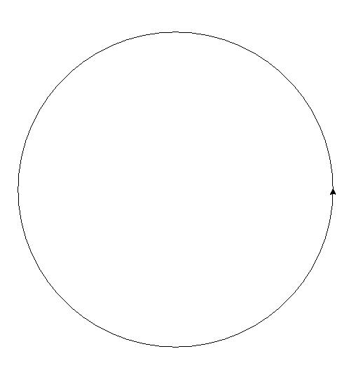
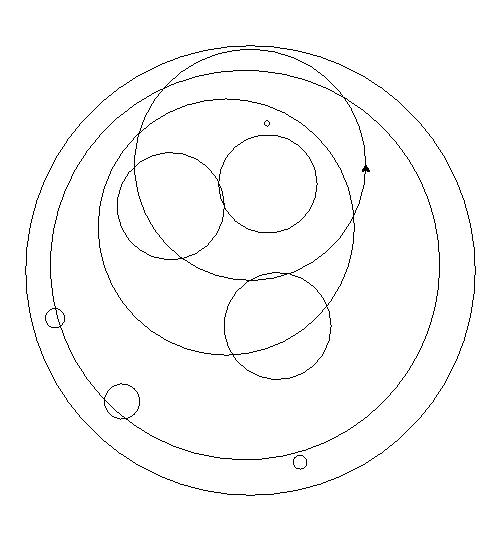
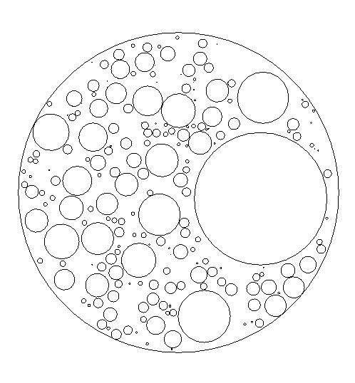
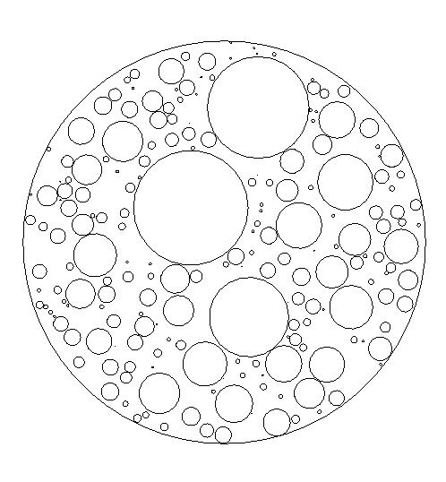
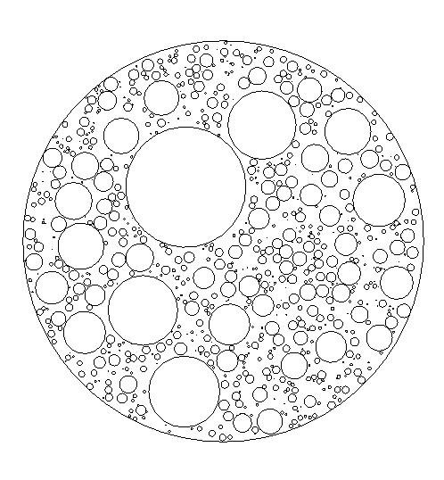

Week 9: Class Exercise solutions
================================

Circle packing generative art
-----------------------------
Part 1
^^^^^^
::

    import turtle

    t = turtle.Turtle()
    screen = turtle.Screen()

    # Draw faster
    screen.delay(1)
    t.speed(10)

    t.penup()
    t.setposition(300, 0) # Set to East
    t.setheading(90) # Set to North
    t.pendown()
    t.circle(300)
    t.penup()

    def draw_circle(x, y, r):
        # Draws a circle at (x, y) with radius r.
        t.penup()
        t.setposition(x+r, y) # Set to East
        t.setheading(90) # Set to North
        t.pendown()
        t.circle(r)
        t.penup()

    draw_circle(0, 0, 300)

    turtle.done()

Part 2
^^^^^^
::

    import turtle
    import numpy as np

    t = turtle.Turtle()
    screen = turtle.Screen()

    # Draw faster
    screen.delay(1)
    t.speed(10)

    def draw_circle(x, y, r):
        # Draws a circle at (x, y) with radius r.
        t.penup()
        t.setposition(x+r, y) # Set to East
        t.setheading(90) # Set to North
        t.pendown()
        t.circle(r)
        t.penup()

    def check_circle_within_frame(x, y, r, fr):
        # Angle of a line from origin to the circle's center
        vec = np.array([x, y])
        uvec = vec / np.linalg.norm(vec)
        vec = vec + uvec * r
        dist = np.linalg.norm(vec)
        if dist > fr:
            return False
        else:
            return True

    ## Main block
    FRAMERADIUS = 300
    draw_circle(0, 0, FRAMERADIUS)

    for i in range(10):
        while True:
            x = np.random.uniform(low=-FRAMERADIUS, high=FRAMERADIUS)
            y = np.random.uniform(low=-FRAMERADIUS, high=FRAMERADIUS)
            r = np.random.uniform(low=0, high=FRAMERADIUS)
        
            if check_circle_within_frame(x, y, r, FRAMERADIUS) is True:
                break

        draw_circle(x, y, r)

    turtle.done()

Part 3
^^^^^^
::

    import turtle
    import numpy as np

    t = turtle.Turtle()
    screen = turtle.Screen()

    # Draw faster
    screen.delay(1)
    t.speed(10)

    # Draw even faster!
    t.hideturtle()
    screen.tracer(False)

    def draw_circle(x, y, r):
        # Draws a circle at (x, y) with radius r.
        t.penup()
        t.setposition(x+r, y) # Set to East
        t.setheading(90) # Set to North
        t.pendown()
        t.circle(r)
        t.penup()

    def check_circle_within_frame(x, y, r, fr):
        # Angle of a line from origin to the circle's center
        vec = np.array([x, y])
        uvec = vec / np.linalg.norm(vec)
        vec = vec + uvec * r
        dist = np.linalg.norm(vec)
        if dist > fr:
            return False
        else:
            return True

    def two_circles_intersect(x1, y1, r1, x2, y2, r2):
        # Returns True if both circles intersect each other
        center1 = np.array([x1, y1])
        center2 = np.array([x2, y2])
        dist = np.linalg.norm(center2 - center1)

        if dist <= r1 + r2:
            return True
        else:
            return False
        

    def check_circle_no_intersect(x, y, r, circles):
        # Returns True if specified circle does not intersect with any existing circle
        for prevcircle in circles:
            prevx, prevy, prevr = prevcircle[0], prevcircle[1], prevcircle[2]
            if two_circles_intersect(x, y, r, prevx, prevy, prevr) is True:
                return False
        return True

    ## Main block
    FRAMERADIUS = 300
    draw_circle(0, 0, FRAMERADIUS)
    circles = []

    for i in range(200):
        while True:
            x = np.random.uniform(low=-FRAMERADIUS, high=FRAMERADIUS)
            y = np.random.uniform(low=-FRAMERADIUS, high=FRAMERADIUS)
            r = np.random.uniform(low=0, high=FRAMERADIUS)
        
            if check_circle_within_frame(x, y, r, FRAMERADIUS) is True:
                if check_circle_no_intersect(x, y, r, circles) is True:
                    print("X")
                    break
            
            print("O", end="")

        circles.append((x, y, r))

    for x, y, z in circles:
        draw_circle(x, y, z)

    turtle.done()

Part 4
^^^^^^
::

    import turtle
    import numpy as np

    t = turtle.Turtle()
    screen = turtle.Screen()

    # Draw faster
    screen.delay(1)
    t.speed(10)

    # Draw even faster!
    t.hideturtle()
    screen.tracer(False)

    def draw_circle(x, y, r):
        # Draws a circle at (x, y) with radius r.
        t.penup()
        t.setposition(x+r, y) # Set to East
        t.setheading(90) # Set to North
        t.pendown()
        t.circle(r)
        t.penup()

    def check_circle_within_frame(x, y, r, fr):
        # Angle of a line from origin to the circle's center
        vec = np.array([x, y])
        uvec = vec / np.linalg.norm(vec)
        vec = vec + uvec * r
        dist = np.linalg.norm(vec)
        if dist > fr:
            return False
        else:
            return True

    def two_circles_intersect(x1, y1, r1, x2, y2, r2):
        # Returns True if both circles intersect each other
        center1 = np.array([x1, y1])
        center2 = np.array([x2, y2])
        dist = np.linalg.norm(center2 - center1)

        if dist <= r1 + r2:
            return True
        else:
            return False
        

    def check_circle_no_intersect(x, y, r, circles):
        # Returns True if specified circle does not intersect with any existing circle
        for prevcircle in circles:
            prevx, prevy, prevr = prevcircle[0], prevcircle[1], prevcircle[2]
            if two_circles_intersect(x, y, r, prevx, prevy, prevr) is True:
                return False
        return True

    ## Main block
    FRAMERADIUS = 300
    MAXITER = 3000
    draw_circle(0, 0, FRAMERADIUS)

    circles = []
    itercount = 0
    rlim = FRAMERADIUS
    avgrejects = 0
    pastrejectcounter = 0
    rejectcounter = 0

    for i in range(200):
        while itercount <= MAXITER:
            x = np.random.uniform(low=-FRAMERADIUS, high=FRAMERADIUS)
            y = np.random.uniform(low=-FRAMERADIUS, high=FRAMERADIUS)
            r = np.random.uniform(low=0, high=rlim)
        
            if check_circle_within_frame(x, y, r, FRAMERADIUS) is True:
                if check_circle_no_intersect(x, y, r, circles) is True:
                    print("X")
                    break
            
            rejectcounter += 1
            print("O", end="")

        avgrejects = avgrejects * 0.8 + 0.2 * (rejectcounter - pastrejectcounter)
        pastrejectcounter = rejectcounter
        print("Exponentially weighted average reject rate is", str(avgrejects))
        if avgrejects >= 10:
            rlim = rlim * 0.9
            print("New decreased rlim:", rlim)
        elif avgrejects <= 5:
            rlim = rlim * 1.1
            print("New increased rlim:", rlim)
            

        circles.append((x, y, r))

    for x, y, z in circles:
        draw_circle(x, y, z)

    print("Itercount is", str(rejectcounter + len(circles)), "num circles is:", len(circles))
    turtle.done()

Part 5
^^^^^^
::

    import turtle
    import numpy as np

    t = turtle.Turtle()
    screen = turtle.Screen()

    # Draw faster
    screen.delay(1)
    t.speed(10)

    # Draw even faster!
    t.hideturtle()
    screen.tracer(False)

    def draw_circle(x, y, r):
        # Draws a circle at (x, y) with radius r.
        t.penup()
        t.setposition(x+r, y) # Set to East
        t.setheading(90) # Set to North
        t.pendown()
        t.circle(r)
        t.penup()

    def check_circle_within_frame(x, y, r, fr):
        # Angle of a line from origin to the circle's center
        vec = np.array([x, y])
        uvec = vec / np.linalg.norm(vec)
        vec = vec + uvec * r
        dist = np.linalg.norm(vec)
        if dist > fr:
            return False
        else:
            return True

    def two_circles_intersect(x1, y1, r1, x2, y2, r2):
        # Returns True if both circles intersect each other
        center1 = np.array([x1, y1])
        center2 = np.array([x2, y2])
        dist = np.linalg.norm(center2 - center1)

        if dist <= r1 + r2:
            return True
        else:
            return False
        

    def check_circle_no_intersect(x, y, r, circles):
        # Returns True if specified circle does not intersect with any existing circle
        for prevcircle in circles:
            prevx, prevy, prevr = prevcircle[0], prevcircle[1], prevcircle[2]
            if two_circles_intersect(x, y, r, prevx, prevy, prevr) is True:
                return False
        return True

    def calc_packing_efficiency(circles, framearea):
        # Returns the packing efficiency of drawn circles
        packed_area = 0
        for circle in circles:
            r = circle[2]
            packed_area += np.pi * r ** 2
        
        print("Packed area / total area: %.2f/%.2f = %.3f" % (packed_area, framearea, packed_area/framearea))
        return packed_area / framearea

    ## Main block
    FRAMERADIUS = 300
    FRAMEAREA = np.pi * FRAMERADIUS ** 2
    MAXITER = 10000
    draw_circle(0, 0, FRAMERADIUS)

    circles = []
    rlim = FRAMERADIUS
    avgrejects = 0
    pastrejectcounter = 0
    rejectcounter = 0

    while calc_packing_efficiency(circles, FRAMEAREA) <= 0.8:
        if rejectcounter + len(circles) >= MAXITER:
                print(f"Max iterations reached at {MAXITER}!")
                print(f"Final packing efficiency is {calc_packing_efficiency(circles, FRAMEAREA):.3f}")
                break
        while True:
            x = np.random.uniform(low=-FRAMERADIUS, high=FRAMERADIUS)
            y = np.random.uniform(low=-FRAMERADIUS, high=FRAMERADIUS)
            r = np.random.uniform(low=0, high=rlim)
        
            if check_circle_within_frame(x, y, r, FRAMERADIUS) is True:
                if check_circle_no_intersect(x, y, r, circles) is True:
                    print("X")
                    break
            
            rejectcounter += 1
            print("O", end="")

        avgrejects = avgrejects * 0.8 + 0.2 * (rejectcounter - pastrejectcounter)
        pastrejectcounter = rejectcounter
        print("Exponentially weighted average reject rate is", str(avgrejects))
        if avgrejects >= 8:
            rlim = rlim * 0.9
            print("New decreased rlim:", rlim)
        elif avgrejects <= 3:
            rlim = rlim * 1.1
            print("New increased rlim:", rlim)
            

        circles.append((x, y, r))

    for x, y, z in circles:
        draw_circle(x, y, z)

    print("Itercount is", str(rejectcounter + len(circles)), "num circles is:", len(circles))
    turtle.done()

To save your images, add the following code chunk before `turtle.done()`, specifying the filename as required:
::

    # Added code chunk to save images
    import io
    from PIL import Image
    cv = screen.getcanvas()
    ps = cv.postscript()
    im = Image.open(io.BytesIO(ps.encode("utf-8")))
    im.save("week9-sol1.jpg")

